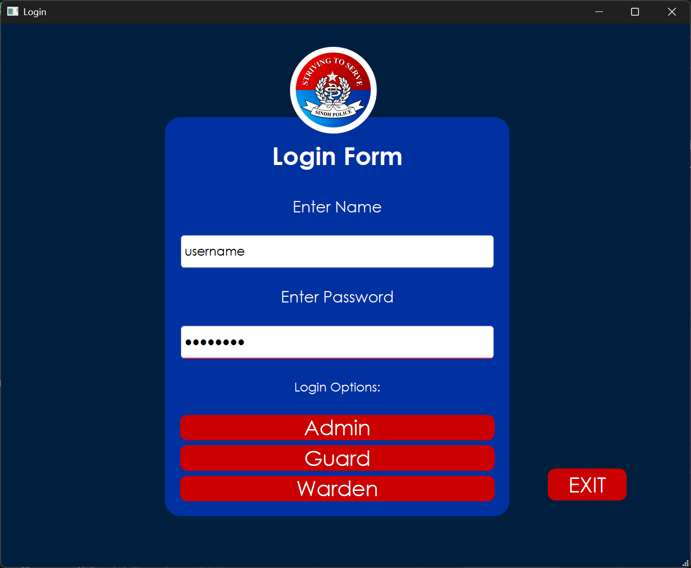
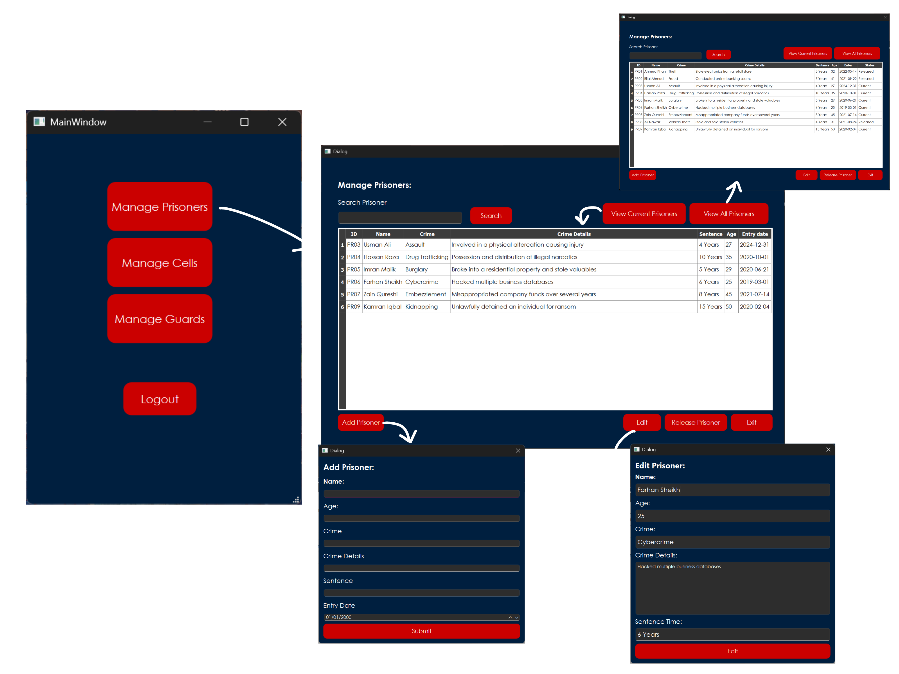
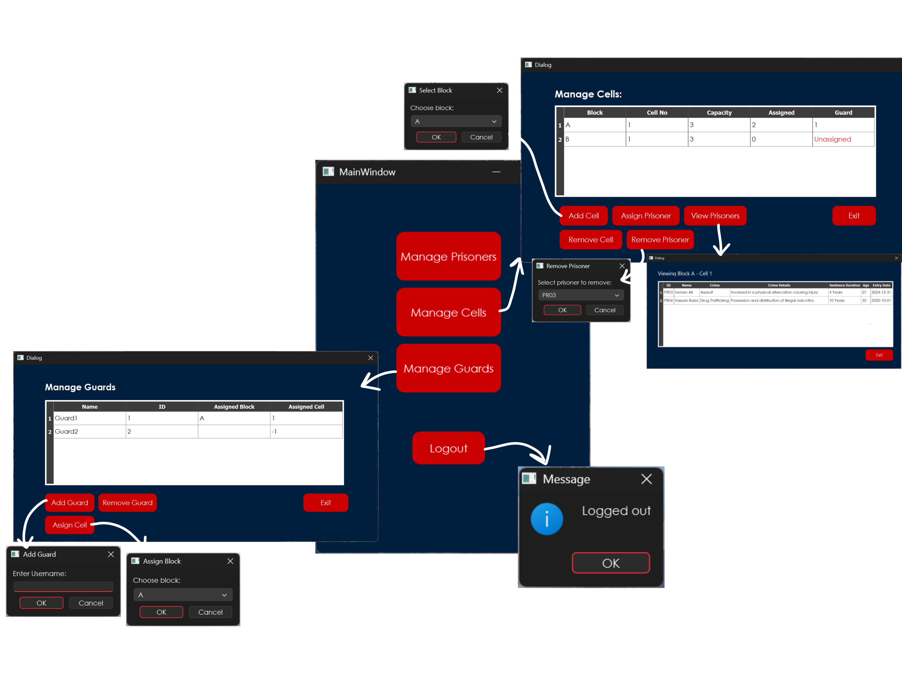
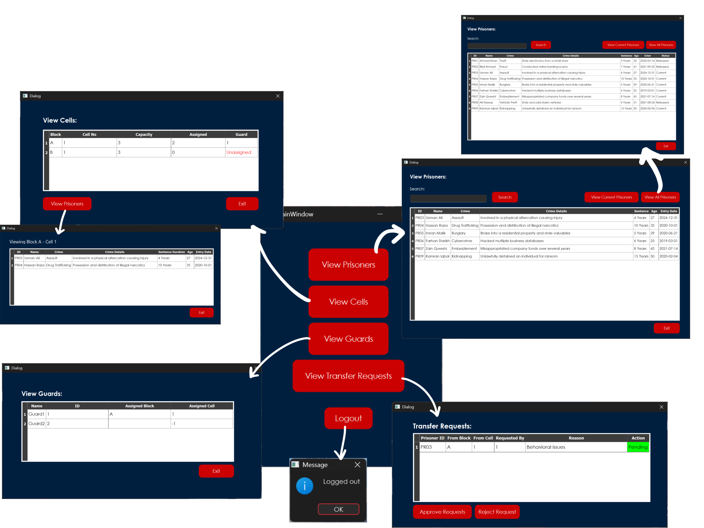
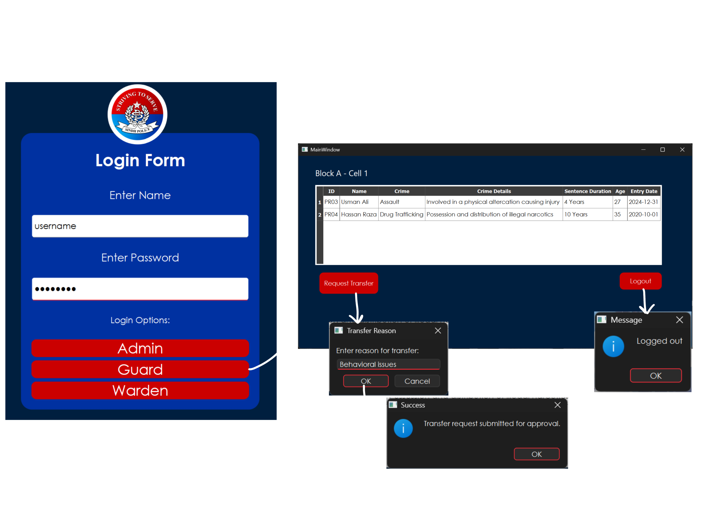

# Prison Management System

A desktop application built with **C++** and **Qt (Qt Creator)** that simulates the day-to-day administration of a prison — managing prisoners, cells, guards, and inter-cell transfer requests, with role-based access for **Admin**, **Warden**, and **Guard** users.

## Screenshots

### Login


### Admin Dashboard




### Warden Dashboard


### Guard Dashboard


## Features

### 🔐 Role-Based Login
Three separate roles, each routed to its own dashboard after authentication:
- **Admin** — full management access (prisoners, cells, guards)
- **Warden** — oversight access (view prisoners/cells/guards, approve/reject transfer requests)
- **Guard** — limited access scoped to their assigned cell

### 👤 Admin Dashboard
- **Manage Prisoners** — add, edit, search, release (soft-delete via `isActive` flag), and view current/all prisoner records
- **Manage Cells** — create cells per block (A/B), assign/remove prisoners, view a cell's occupants, delete cells (with safe unassignment of prisoners and guards)
- **Manage Guards** — add guards, assign them to a block/cell, remove guards (auto-unassigns their cell)

### 🛡️ Guard Dashboard
- View prisoners housed in their assigned cell
- Submit **transfer requests** for a prisoner, with a reason, for warden approval

### 🏛️ Warden Dashboard
- View all prisoners, cells, and guards (read-only)
- **Approve/Reject transfer requests** — approving a request lets the warden pick an available target cell, which then moves the prisoner and updates both the source and destination cells

## Tech Stack & Concepts

- **Language:** C++
- **Framework:** Qt Widgets (built in Qt Creator, `.ui` forms + signal/slot architecture)
- **Persistence:** Binary file storage using `QDataStream` (`prisoners.dat`, `guards.dat`, `blockA_cells.dat`, `blockB_cells.dat`, `transfer_requests.dat`, `admins.dat`, `wardens.dat`)
- **OOP Concepts Demonstrated:**
  - **Inheritance** — `Guard` inherits from a base `User` class (shared with Admin/Warden authentication)
  - **Encapsulation** — private data members with getter/setter interfaces across all model classes
  - **Operator Overloading** — custom `operator<<` / `operator>>` for serializing/deserializing each model (`Prisoner`, `Cell`, `Guard`, `User`, `TransferRequest`) to/from `QDataStream`
  - **Static Methods** — e.g. `Prisoner::LoadAllPrisoners()`, `Cell::loadAllCells()`, `Guard::loadAllGuards()`, `Prisoner::generateUniqueID()`
  - **Composition** — `Cell` holds a list of assigned prisoner IDs and resolves them into full `Prisoner` objects on load

## Project Structure

```
├── main.cpp                  # Entry point, initializes default Admin/Warden accounts
├── login.cpp/h                # Login screen, routes to role-specific dashboard
├── user.cpp/h                 # Base User class + admin/warden authentication
│
├── admindashboard.cpp/h       # Admin landing page
├── guarddashboard.cpp/h       # Guard landing page
├── wardendashboard.cpp/h      # Warden landing page
│
├── prisoner.cpp/h              # Prisoner model + file I/O
├── addprisoner.cpp/h           # Add-prisoner dialog
├── editprisoner.cpp/h          # Edit-prisoner dialog
├── manageprisoners.cpp/h       # Admin: full prisoner CRUD table
├── viewprisoners.cpp/h         # Warden: read-only prisoner table
│
├── cell.cpp/h                  # Cell model + file I/O (per block)
├── managecells.cpp/h           # Admin: cell CRUD + prisoner assignment
├── viewcells.cpp/h             # Warden: read-only cell table
├── viewprisonersincell.cpp/h   # Dialog showing prisoners in a specific cell
│
├── guard.cpp/h                  # Guard model + file I/O + authentication
├── manageguards.cpp/h           # Admin: guard CRUD + cell assignment
├── viewguards.cpp/h              # Warden: read-only guard table
│
├── transferrequest.cpp/h         # Transfer request model + file I/O
└── wardenapprovaldialog.cpp/h    # Warden: approve/reject transfer requests
```

## Default Login Credentials

On first run, the app seeds two default accounts:

| Role   | Username | Password   |
|--------|----------|------------|
| Admin  | Admin1   | admin123   |
| Warden | Warden1  | warden123  |

Guards are created via **Admin → Manage Guards → Add Guard**.

## Getting Started

### Prerequisites
- [Qt Creator](https://www.qt.io/download) (Qt 5 or 6)
- A C++ compiler (MinGW / MSVC / GCC, depending on platform)

### Build & Run
1. Clone the repository
   ```bash
   git clone https://github.com/<your-username>/prison-management-system.git
   ```
2. Open the `.pro` file in Qt Creator
3. Build and run (`Ctrl+R` / green ▶ button)
4. On first launch, the app auto-generates `admins.dat` and `wardens.dat` with the default credentials above

> **Note:** This app stores data in local binary files (`.dat`) created in the build/run directory. Make sure the app has write permissions there.

## Roadmap / Possible Improvements
- [ ] Replace `QDataStream` flat-file storage with a proper **SQLite backend** (`QSqlDatabase`) for more robust, queryable persistence
- [ ] Hash passwords instead of storing them in plaintext
- [ ] Add unit tests for model classes
- [ ] Export prisoner/cell reports to PDF or CSV

## License
This project is open source and available under the [MIT License](LICENSE).
